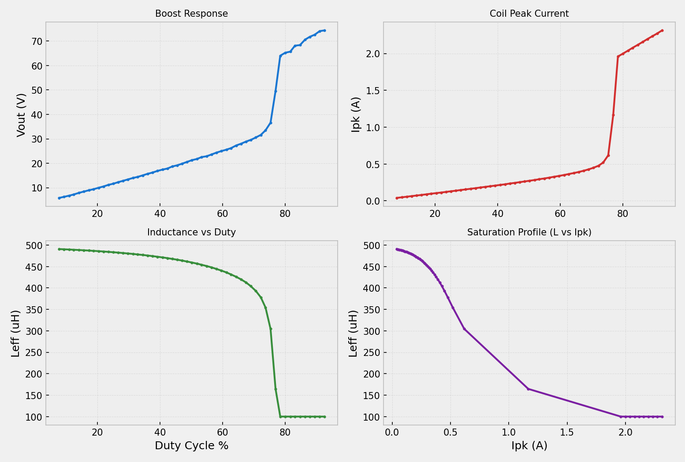

# Precision Coil Measurement Instrument

Advanced ecosystem for measuring and analyzing coil inductance and magnetic saturation, featuring high-fidelity physics simulation, automated loss calibration, and a real-time PC measurement suite.

## Key Components

- **`precision_coil_meter.ino`**: Command-driven Arduino firmware (ATmega328P) using DCM power-balance logic and on-device grid-search calibration for hardware losses ($V_d$, $R_s$).
- **`pc_precision_meter.py`**: Tkinter-based PC GUI for real-time visualization of boost response, peak current, and saturation profiles.
- **`emulator.py`**: High-fidelity Python physics engine modeling DCM boost converter dynamics, soft-saturation ($L$ vs $I_{pk}$), and realistic ADC noise.
- **`virtual_serial_instrument.py`**: A PTY-based bridge that allows testing the PC GUI using the physics emulator without physical hardware.

## Features

- **Automated Calibration**: Solves for component losses to establish a stable inductance baseline.
- **Real-time Tracking**: Visualizes effective inductance ($L_{eff}$) as a function of duty cycle and peak current.
- **Data Export**: Save high-resolution dashboards (PNG) and raw measurement telemetry (CSV).
- **Simulation Suite**: Headless evaluation of firmware accuracy using the C++ Arduino mock and Python emulator.

## PC Measurement Tool

The `pc_precision_meter.py` tool provides a professional laboratory interface for data collection:



### Usage

1. **Connect**: Select the serial port and click 'Connect'.
2. **Calibrate**: Click 'Calibrate' to perform the multi-point loss characterization.
3. **Sweep**: Click 'Start Sweep' to begin the duty cycle ramp and generate the saturation profile.
4. **Export**: Use the 'Export CSV' or 'Export PNG' buttons to save your results.

## Simulation and Verification

To verify the instrument's accuracy and firmware logic in the sandbox:

```bash
# Headless accuracy evaluation
g++ -O3 main.cpp arduino_mock.cpp -o arduino_app
python3 generate_graphs.py
```

This generates `test_results.png`, showing inferred vs. actual ground-truth inductance.


## Hardware Implementation

- **PWM Pin (9)**: Drives the MOSFET (Direct Timer1 control for frequency agility).
- **Vout Pin (A0)**: 10x resistive divider feedback.
- **Vin Pin (A1)**: 1.0 Ohm current sense feedback.
- **Supply**: 5.0V regulated input.
