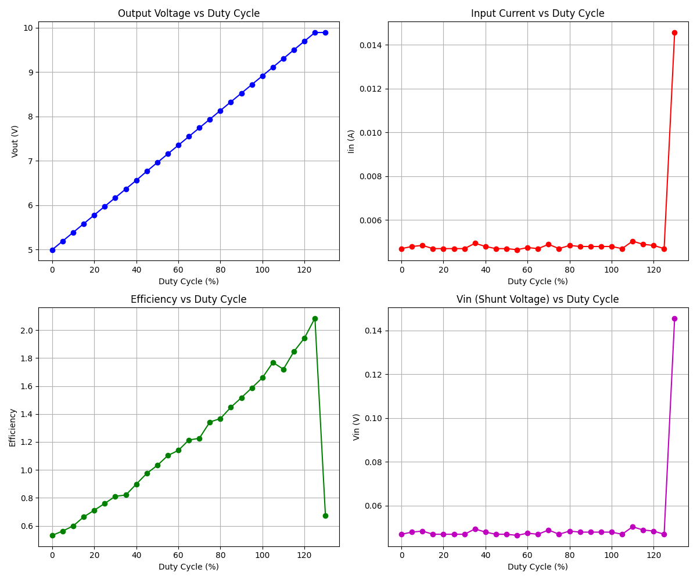

# Coil Saturation Tester

Arduino firmware to detect if a coil in a boost converter circuit is entering the magnetic saturation stage.

## Files

- `coil_saturation_tester_function.ino`: Main firmware with saturation detection logic.
- `emulator.py`: Python physics emulator that models a boost converter with coil saturation and noise.
- `arduino_mock.h` / `arduino_mock.cpp`: C++ mocks for the Arduino API to enable desktop testing.
- `main.cpp`: Test runner that wraps the Arduino code.
- `generate_graphs.py`: Script to run the test and generate diagnostic plots.

## Testing Environment

This repository includes a hybrid testing system that allows you to verify the firmware logic on a desktop computer without real hardware.

### Prerequisites

- `g++` (for compiling the C++ mock environment)
- `python3`
- `matplotlib` (for generating graphs)

### How to Run

1. **Compile the test binary:**
   ```bash
   g++ -o test_arduino main.cpp arduino_mock.cpp -I.
   ```

2. **Run the simulation and generate graphs:**
   ```bash
   python3 generate_graphs.py
   ```

The script will execute the `test_arduino` binary, which in turn calls the `emulator.py` for each simulated analog reading. The results will be saved to `test_results.png`.

### Saturation Detection Logic

The firmware sweeps the PWM duty cycle and calculates the converter's efficiency. When the magnetic core saturates, the efficiency drops sharply due to increased resistive losses and decreased inductance. The code identifies this drop and reports the saturation level.


